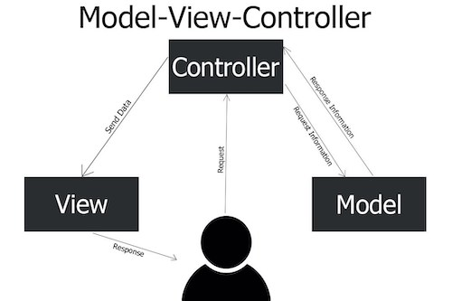

# burger -- Full Stack Web Application with MVC model

This is a prototype of a Full Stack Web Application with MVC model. The file structure is designed for large production system, including:
* MySql database with ORM model
* Node.js Server
  - express for routing control
  - express-handlebars for dynamic views
* ajax and JQuery  

## MVC Model



----

The file structure is as follows:

```
|
├── config    .............. directory for database implementation
│   ├── connection.js  ..... connect to database(password, database name)
│   └── orm.js  ............ semi-standard to define create, update, delete, real for the database 
│                            (the database SQL implemtation is here. SQL commands here  )
├── controllers
│   └── burgerControl.js ...  The API routes are defined here with "router = express.Router();"
├── models .................  Define each table's ORM here. database independent implementation
│   │                         (No SQL commands here. )
│   └── burgersModel.js   ..  "burgers" table (CRUD)
├── public   ...............  directory defined as "static" as Apache's "httpd" 
│   ├── assets
│   │   ├── css ............  css files for all files
│   │   │   └── style.css 
│   │   ├── img  ...........  images for all files
│   │   │   └── burger.gif 
│   │   └── js   ...........  all client JavaScript  files   
│   │       └── burger.js ..  ajax functions
│   └── anyName.html .......  Any files under public will be displayed as web page 
├── server.js  .............  This is the starting program The Server, PORT #
└── views      .............  VIEW for express handlebars
    ├── index.handlebars ...  dynamic page, called by control.js as res.render("index", obj)
    │                         to render a dynamic page inside main.handlebars
    ├── layouts
    │    └── main.handlebars This is the main HTML design template {{{body}}} -- 
    │                         Called by server.js as default layout 
    │                         all jQuery, bootstrap, css, JavaScript are included here
    └── partials
         └── xxxx.handlebars  any partial handlebars ( {{< xxxx}})

```